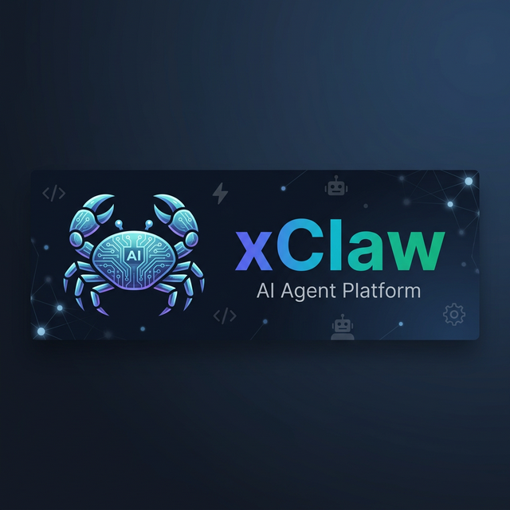
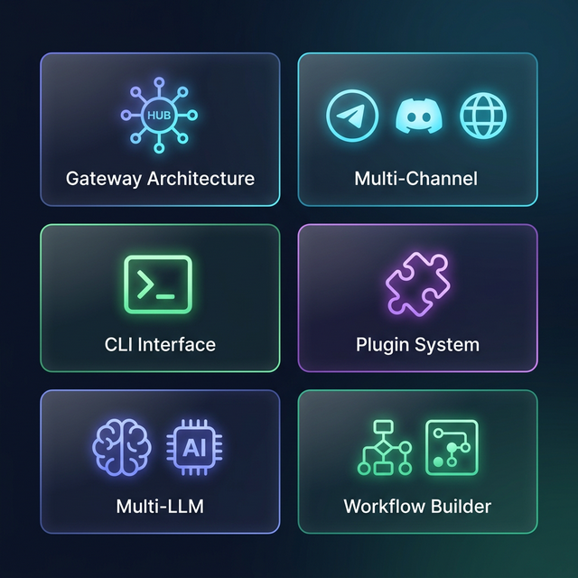
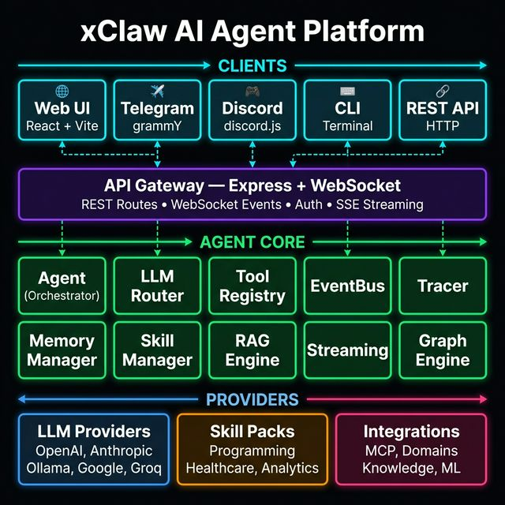
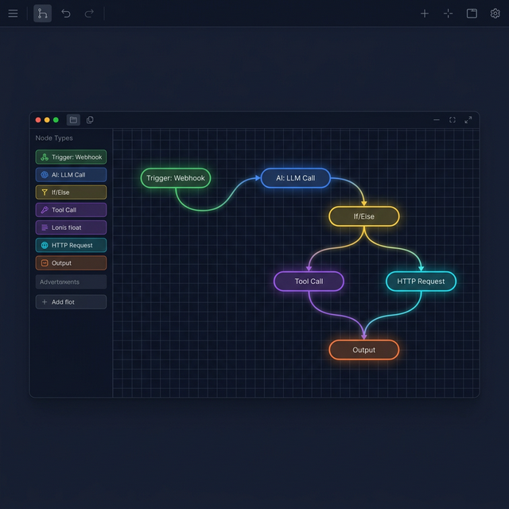
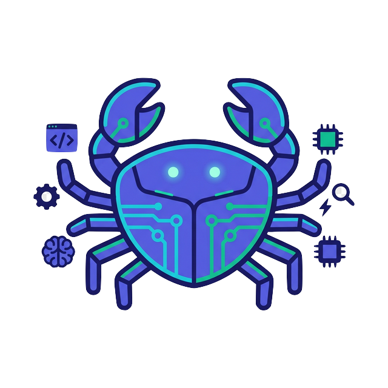

<p align="center">
  
</p>

<p align="center">
  <a href="#features"></a>
  <a href="#getting-started"></a>
  <a href="#documentation"></a>
  <a href="https://github.com/tdduydev/xClaw/blob/main/LICENSE"></a>
</p>

<p align="center">
  
  
  
  
  
  
</p>

<br/>

<p align="center">
  <em>Open-source AI Agent platform with Gateway architecture, multi-channel support (Telegram, Discord), drag-and-drop Workflow Builder, and CLI interface.</em>
  <br/>
  <em>Inspired by <a href="https://openclaw.ai/">OpenClaw</a></em>
</p>

---

## ✨ Features

<p align="center">
  
</p>

| Feature | Description |
|:---:|---|
| 🌐 **Gateway Architecture** | WebSocket control plane with session management, heartbeat, and event broadcasting |
| 📡 **Multi-Channel** | Telegram (grammY), Discord (discord.js), Web UI, REST API — connect your agent everywhere |
| ⌨️ **CLI Interface** | `xclaw gateway`, `xclaw chat`, `xclaw skills`, `xclaw doctor` |
| 🧩 **Plugin System** | npm-distributable plugins with `xclaw.plugin.json` manifests |
| 🧠 **Multi-LLM Support** | OpenAI, Anthropic Claude, Ollama (local) |
| 🔄 **Workflow Builder** | React Flow canvas with 16 node types |
| 💬 **AI Chat Interface** | Tool-calling agent loop (max 10 iterations) |
| 🏥 **Healthcare Module** | Symptom analysis, medication management, health metrics |
| 💻 **Programming Module** | Shell, Git, file management, test runner |
| 📢 **Event-Driven** | Pub/sub EventBus with wildcard support |
| 🐳 **Docker Ready** | One-command deployment |

---

## 🏗️ Architecture

<p align="center">
  
</p>

---

## 🔄 Workflow Builder

<p align="center">
  
</p>

**16 node types** in a drag-and-drop visual canvas:

| Category | Nodes |
|:---:|---|
| 🟢 **Trigger** | Manual, Cron, Webhook, Message, Event |
| 🤖 **AI** | LLM Call |
| ⚡ **Action** | Tool Call, HTTP Request, Run Code, Notification |
| 🔀 **Control** | If/Else, Loop, Switch, Wait, Merge |
| 💾 **Data** | Transform, Memory Read/Write, Sub-Workflow |
| 📤 **Output** | Output |

---

## 📚 Documentation

| Document | Description |
|:---:|---|
| 📐 [System Architecture](docs/architecture.md) | Component diagram, data flow |
| 📖 [API Reference](docs/api-reference.md) | REST & WebSocket endpoints |
| 🛠️ [Skill Development](docs/skill-development.md) | How to create skill packs |
| 🔄 [Workflow Engine](docs/workflow-engine.md) | BFS execution, node types |

---

## 📁 Project Structure

```
xclaw/
├── packages/
│   ├── shared/              # Type definitions (Gateway, Channel, Plugin types)
│   ├── core/                # Agent engine, LLM router, memory, workflow, plugins
│   │   ├── agent/           # Agent core + EventBus
│   │   ├── llm/             # Multi-provider LLM adapter
│   │   ├── memory/          # Vector memory with cosine similarity
│   │   ├── tools/           # Tool registry with approval system
│   │   ├── skills/          # Skill manager
│   │   ├── plugins/         # Plugin loader (xclaw.plugin.json)
│   │   └── workflow/        # Workflow engine (BFS execution)
│   ├── gateway/             # WebSocket control plane
│   │   ├── gateway.ts       # Gateway server (WS + REST)
│   │   ├── session-manager.ts
│   │   └── channel-manager.ts
│   ├── cli/                 # CLI interface (xclaw command)
│   │   └── commands/        # gateway, chat, skills, doctor
│   ├── channels/
│   │   ├── telegram/        # Telegram bot (grammY)
│   │   └── discord/         # Discord bot (discord.js)
│   ├── skills/              # Built-in skill packs
│   │   ├── programming/     # 11 tools: shell, git, files, tests
│   │   └── healthcare/      # 11 tools: symptoms, medications, metrics
│   ├── server/              # Server entry point (launches Gateway)
│   └── web/                 # React + Vite + React Flow + Tailwind
├── docs/                    # System design documentation
├── Dockerfile
├── docker-compose.yml
└── .env.example
```

---

## 🚀 Getting Started

### Prerequisites

- Node.js >= 20
- npm >= 10

### Installation

```bash
git clone https://github.com/tdduydev/xClaw.git
cd xClaw
npm install
cp .env.example .env
# Edit .env with your LLM API key
```

### Start the Gateway

```bash
# Start Gateway (WebSocket control plane on ws://127.0.0.1:18789)
npm run dev:server

# In another terminal, start the Web UI
npm run dev:web
# Open http://localhost:3000
```

### CLI Usage

```bash
# Start the gateway
npx tsx packages/cli/src/index.ts gateway

# Chat with the agent
npx tsx packages/cli/src/index.ts chat "Hello, what can you do?"

# List skills
npx tsx packages/cli/src/index.ts skills list

# System health check
npx tsx packages/cli/src/index.ts doctor
```

### Channel Plugins

Add bot tokens to `.env` to auto-enable channels:

```env
TELEGRAM_BOT_TOKEN=your-telegram-token
DISCORD_BOT_TOKEN=your-discord-token
```

### Docker

```bash
docker compose up -d
```

---

## 🧩 Plugin System

Create plugins distributed as npm packages with `xclaw.plugin.json`:

```json
{
  "name": "@xclaw/channel-telegram",
  "version": "0.1.0",
  "description": "Telegram channel plugin",
  "type": "channel",
  "entry": "dist/index.js",
  "platforms": ["telegram"],
  "config": [
    { "key": "botToken", "type": "secret", "required": true }
  ],
  "permissions": ["network"]
}
```

Plugin types: `skill`, `channel`, `integration`, `theme`.

---

## 🧠 LLM Configuration

| Provider | Models | Notes |
|:---:|---|---|
|  | gpt-4o-mini, gpt-4o | Requires `LLM_API_KEY` |
|  | claude-3-haiku, claude-3-sonnet | Requires `LLM_API_KEY` |
|  | llama3, mistral, phi3 | Local, free |

---

## 🛠️ Skill Packs

### 💻 Programming (11 tools)

`shell_exec` `file_read` `file_write` `file_list` `git_status` `git_diff` `git_commit` `git_log` `run_tests` `code_search` `project_analyze`

### 🏥 Healthcare (11 tools)

`symptom_analyze` `medication_check_interaction` `medication_schedule` `health_metrics_log` `health_metrics_query` `appointment_manage` `medical_record` `health_report` `clinical_note` `icd_lookup`

---

## 🗺️ Roadmap

- [ ] Database persistence (PostgreSQL/MongoDB)
- [ ] Authentication & multi-user
- [x] Gateway WebSocket control plane
- [x] CLI interface
- [x] Telegram channel plugin
- [x] Discord channel plugin
- [x] Plugin manifest system (xclaw.plugin.json)
- [ ] Skill marketplace
- [ ] WhatsApp / Slack / Signal channels
- [ ] Streaming chat responses
- [ ] Mobile app (React Native)

---

## 🤝 Contributing

Contributions are welcome! Open an Issue or Pull Request.

---

<p align="center">
  
  <br/>
  <strong>MIT</strong> © <a href="https://github.com/tdduydev">Tran Duc Duy</a>
  <br/>
  <sub>Built with ❤️ by <a href="https://xdev.asia">xDev.asia</a></sub>
</p>
